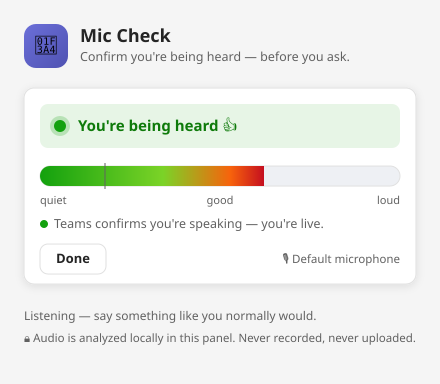

# Can U Hear Me Now — Teams Mic Check

[](https://github.com/rod-trent/mic-check/actions/workflows/ci.yml)
[](https://github.com/rod-trent/mic-check/actions/workflows/pages.yml)
[](LICENSE)

An in-meeting Microsoft Teams side panel that kills the "can you hear me?" ritual.
Open the panel, run a two-second check, and get a clear verdict — **"You're being heard 👍"** —
with a live input-level meter, before you ever speak up.



**▶ Live demo:** [rod-trent.github.io/mic-check](https://rod-trent.github.io/mic-check/) — try the meter right in your browser (no Teams needed).

> **Tier 1 (this build):** confirms *your own* mic is producing audio, analyzed locally
> via the Web Audio API. Nothing is recorded or uploaded.
>
> **Tier 2 (future):** a Graph Communications media bot that joins the meeting and
> confirms per-participant "you're being heard" from the receiving side. See
> [Roadmap](#roadmap).

## What it does

- 🎚 **Live level meter** — real-time RMS of your mic input.
- ✅ **Plain-language verdict** — "You're being heard", "Faint — speak up", or
  "Nothing coming through — check you're not muted".
- 🌗 **Theme-aware** — matches Teams light / dark / high-contrast.
- 📡 **Best-effort Teams signal** — if the meeting exposes it, shows Teams' own
  "you're speaking" confirmation as a second data point.
- 🔒 **Private by design** — audio never leaves the panel; no recording, no upload.

## Why not just "listen to both sides"?

A standard Teams app runs in a sandboxed iframe and **cannot access any participant's
audio stream** — not even your own Teams mic stream. There is no per-participant
"who's speaking" stream exposed to tab/panel apps. So Tier 1 verifies your mic through
the browser's `getUserMedia`, which is what actually answers the real anxiety: *is my
audio getting out?* True receiving-side confirmation requires a media bot (Tier 2).

## Project layout

```
src/                Web app (host these files on HTTPS)
  index.html        The mic-check side panel (tab contentUrl)
  config.html       Teams tab configuration page
  styles.css        Theme-aware styling
  app.js            Mic-check logic (Web Audio + Teams SDK)
appPackage/
  manifest.json     Teams app manifest (has REPLACE_WITH_* tokens)
  color.png         192x192 app icon (placeholder — replace before publishing)
  outline.png       32x32 outline icon (placeholder)
scripts/
  make-icons.py     Regenerates placeholder icons (stdlib only)
  package.ps1       Injects host/app-id and zips appPackage.zip
```

## Run it locally (in a browser)

The panel degrades gracefully outside Teams, so you can test the meter directly:

```bash
npm run dev
```

Then open http://localhost:3000 and click **Start mic check**. (Teams theme/meeting
features are inert here, but the meter and verdict work.)

## Build the Teams package

1. **Host the `src/` files** on an HTTPS origin. The included
   [Pages workflow](.github/workflows/pages.yml) already publishes them to
   `https://rod-trent.github.io/mic-check/` — or use Azure Static Web Apps or a dev
   tunnel like `devtunnel host` / ngrok for testing.
2. **Generate icons** (first time only):
   ```bash
   npm run icons
   ```
3. **Build the app package**, injecting the base URL (a path segment like the Pages
   subpath is fine):
   ```bash
   pwsh scripts/package.ps1 -BaseUrl "https://rod-trent.github.io/mic-check"
   ```
   This writes `build/appPackage.zip`. The app id is read from
   [`.appid.txt`](.appid.txt) (a **stable** GUID — never change it once the app is
   published) unless you override it with `-AppId "<your-guid>"`.
4. **Sideload**: Teams → **Apps → Manage your apps → Upload an app → Upload a custom
   app**, pick `build/appPackage.zip`. Add it to a meeting, then open it from the
   meeting toolbar.

## Before you publish to the Teams Store

- [ ] Replace `color.png` / `outline.png` with real brand artwork.
- [ ] Host real `privacy.html` and `terms.html` pages (referenced in the manifest).
- [ ] Fill in `developer.name` / URLs and a stable app `id` (GUID).
- [ ] Bundle the Teams SDK instead of the CDN reference if your review requires it.
- [ ] Validate with the [Teams manifest validator](https://dev.teams.microsoft.com/).
- [ ] Complete Microsoft's store submission + Publisher Attestation.

## Roadmap

**Tier 2 — real "they can hear you":** add a Graph Communications calling bot with
application-hosted media that joins the meeting, runs voice-activity detection on each
participant's incoming audio, and pushes per-user "you're being heard" status to this
panel over a websocket. Requires Azure VM/VMSS hosting, a media endpoint + certificate,
and admin consent for the bot. The panel here is already structured to consume that
signal (see `wireTeamsSpeakingSignal` as the seam).

## Privacy

Tier 1 processes microphone audio **only** in-memory in the panel to compute a level.
No audio is written to disk, buffered, or transmitted. Stopping the check releases the
mic immediately.
