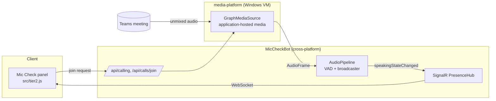

# Tier 2 — "They can hear you" (media bot)

Tier 1 confirms *your own* mic is producing audio (locally, in the panel). **Tier 2 adds
the receiving-side proof**: a bot joins the meeting, receives each participant's audio
directly from the meeting server, and tells each person **"the meeting is receiving your
audio ✅"** — the true answer to "can you hear me?".

> **Status:** foundation in place and runnable with a mock (no Azure). The Windows media
> capture and Azure infra are the remaining work — see [Remaining work](#remaining-work).

## Why a bot is required

A Teams tab/panel app is sandboxed and cannot access any audio stream. The only supported
way to reach meeting audio is a **Graph Communications calling bot with application-hosted
media**, which joins as a participant and receives raw PCM. That bot is Windows-only and
needs public media networking — hence it's a separate service from the Tier 1 static app.

## Architecture



The key design point: **both the mock source and the real media source feed the same
`AudioPipeline`**, so the VAD + SignalR half is identical in dev and prod. Only the audio
*origin* differs.

## Components

| Piece | Where | Runs where |
|---|---|---|
| Panel client | [`src/tier2.js`](../src/tier2.js) | Teams (browser) |
| Signaling + hub + VAD | [`bot/`](../bot) | Anywhere (.NET 9, cross-platform) |
| Media capture | [`bot/media-platform/`](../bot/media-platform) | Windows VM/VMSS |

## Local demo (no Azure)

Prove the panel↔hub↔VAD path end to end with synthetic audio:

```bash
cd bot
dotnet run          # mock source emits two speakers in meeting "demo-meeting"
```

Then enable the panel client against it (e.g. on the local demo page):

```html
<script>window.MICCHECK_BOT_URL = "http://localhost:5000";</script>
<script src="tier2.js"></script>
```

The panel connects to `/hubs/presence`, joins `demo-meeting`, and flips its status line as
the mock speakers start/stop. No meeting, no bot registration, no Azure.

## Azure setup (the real thing)

1. **Azure AD app registration** for the bot. Grant **application** permissions and get
   **admin consent**:
   - `Calls.JoinGroupCall.All`
   - `Calls.AccessMedia.All`
   - (read participant info) `OnlineMeetingParticipant.Read.Chat` etc. via RSC (below)
2. **Azure Bot registration** (Azure Bot resource): enable the **Teams** channel and the
   **Calling** feature; set the calling webhook to `https://<bot-host>/api/calling`.
3. **Media hosting**: deploy `media-platform` to a Windows **VM/VMSS** with:
   - a public **DNS name** + open **TCP media port** (default 8445)
   - a valid **TLS certificate** (thumbprint → `Bot:CertificateThumbprint`)
4. **Manifest additions**: merge [`appPackage/manifest.bot-additions.json`](../appPackage/manifest.bot-additions.json)
   into the app manifest (bot id, `webApplicationInfo`, RSC read permissions), then
   repackage. Keep this **out** of the shipping Tier 1 manifest until the bot exists.
5. **Config**: set `Bot:AppId/AppSecret/TenantId/BotBaseUrl/MediaDnsName/MediaPort/
   CertificateThumbprint`; set `Bot:EnableMockAudio=false`.

## Correlation (which status is "mine")

The media platform tags each unmixed buffer with an `ActiveSpeakerId` (a meeting MSI). Map
it to the participant's AAD object id via `call.Participants`, and broadcast that as
`participantId`. The panel passes its own id as `window.MICCHECK_SELF_ID` (from the Teams
context) and only reacts to matching events. Until correlation is wired, the demo shows any
participant's state.

## Wiring the panel

`tier2.js` is inert unless `window.MICCHECK_BOT_URL` is set. When enabling it in a real
deployment, update the panel CSP in [`src/index.html`](../src/index.html):

- `connect-src` → add your bot origin (for the WebSocket)
- `script-src` → add the SignalR CDN (or self-host the client and keep `script-src 'self'`)

## Remaining work

- [ ] Implement `GraphMediaSource` in a Windows project (sample provided) and wire it to
      `AudioPipeline`, replacing the controller stubs.
- [ ] Participant MSI → AAD id correlation.
- [ ] Meeting-id derivation for the SignalR group (thread id vs. join info).
- [ ] Register AAD app + bot; stand up the media VM + cert.
- [ ] Lock down CORS to the panel origin; authenticate the hub connection (Teams SSO token).
- [ ] Harden VAD (WebRTC/ML) if noisy environments cause flapping.

## Security & privacy notes

- The bot receives meeting audio server-side; it computes only a speaking/energy signal and
  broadcasts booleans — **no audio is recorded or persisted** by this design. Keep it that
  way for parity with the Tier 1 privacy promise.
- Admin consent for `Calls.AccessMedia.All` is significant — document it plainly for the
  reviewing admin (it lets the app access media of calls it joins).
